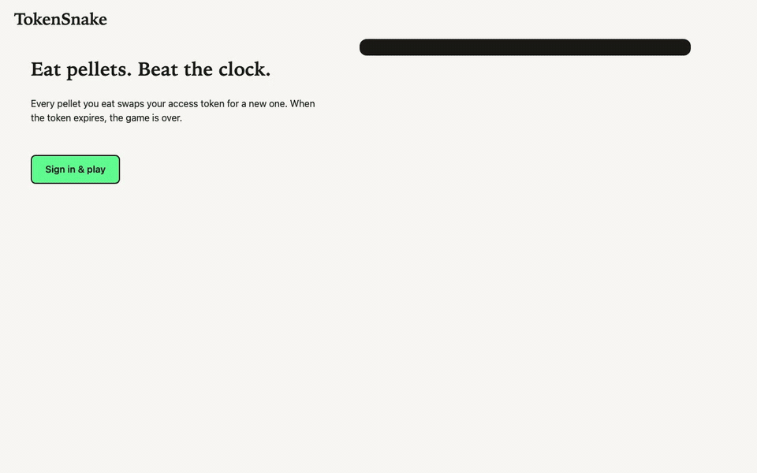

# TokenSnake

A browser Snake game built on Duende IdentityServer. The snake's food is a custom token exchange: every time you eat, the browser trades its current access token for a new one. Token lifetime shrinks as you level up (60, 45, 30, then 20 seconds), and when the token expires the game ends. The details are in the accompanying blog post.



This is a demo. It is not the production recommendation for browser apps (see "Why no BFF?" below).

## Projects

| Project | Role |
|---|---|
| `TokenSnake.Game` | Game rules library with no web dependencies: `GameRules`, `PelletGenerator` (secret seed), `PathReplayEngine`, `MoveValidator`, `LevelRules`, the in-memory game store (10 minutes idle expiry) |
| `TokenSnake.IdentityServer` | Duende IdentityServer host: nickname login and logout pages, the `urn:snake:eat` extension grant, the profile service and the per-level token lifetime validator |
| `TokenSnake.Web` | Serves the static game and the leaderboard API. Validates tokens against IdentityServer |
| `TokenSnake.AppHost` | Aspire launcher for the two hosts |
| `tests/TokenSnake.Tests` | xUnit tests for the rules and integration tests for the grant, login and leaderboard |

## Prerequisites

- .NET 10 SDK
- A trusted development certificate: `dotnet dev-certs https --trust`
- Nothing else for Aspire: the AppHost uses the Aspire AppHost SDK from NuGet, no workload or CLI install is needed. It does need a free port 17001 (dashboard), 21001 and 22001

## Run it

From `TokenSnake`:

```bash
dotnet run --project src/TokenSnake.AppHost
```

This starts both hosts with [Aspire](https://aspire.dev) and stops them together on Ctrl+C. The AppHost waits for IdentityServer before starting the game and passes `TokenSnake__GameOrigin` to both hosts and `TokenSnake__Authority` to the game, so the URLs are defined in one place (`src/TokenSnake.AppHost/Program.cs`). Aspire is only the launcher: the hosts don't reference it. The Aspire dashboard (logs, traces, resource status) is at https://localhost:17001; the login link is printed in the console.

| Host | URL |
|---|---|
| `TokenSnake.IdentityServer` | https://localhost:5001 |
| `TokenSnake.Web` (the game) | https://localhost:5002 |

Or start the hosts manually, each in its own terminal (the `Development` settings point them at each other):

```bash
dotnet run --project src/TokenSnake.IdentityServer
dotnet run --project src/TokenSnake.Web
```

Open https://localhost:5002.

## Play

Pick a nickname and start. There are no credentials. The client is a public client using authorization code flow with PKCE, and its redirect URI is the game's root (`/`). Steer with the arrow keys or WASD, or swipe on the board on a touch screen. The HUD shows how many pellets are left until the next level. Watch the compact JWT panel next to the board: it highlights the claims that change on each meal and counts down the token's expiry. A short note at the top of the panel explains that this is your real access token and points to the BFF. The "What am I looking at?" section expands for more. The "Encoded token" section is open by default, colour-coded into header, payload and signature, with a Copy button. Collapse it if you like, and expand "Header JSON" or "Full payload JSON" for the raw JSON. Finish a game to post your score to the leaderboard (your own row is highlighted).

### Sign out / change nickname

IdentityServer keeps a session cookie, so you stay signed in as the same nickname. Use "Sign out" in the header or "Change nickname" on the game-over screen. The game drops its in-memory tokens, then calls IdentityServer's end-session endpoint with the id token as `id_token_hint` and `post_logout_redirect_uri` set to the game's address. The logout page (`Pages/Account/Logout`) signs the cookie out without a confirmation prompt, which is fine for a demo with no accounts, and redirects back to the start screen. The next "Sign in & play" shows the nickname page again. The id token lives in memory only, like the access token.

## Flow

```
Browser                         IdentityServer              Web host
  | login (nickname) ------------->|                            |
  |<-- access token (lobby) -------|                            |
  | start game ------------------->|                            |
  |<-- game token (level 1) -------|                            |
  | eat + move string ------------>| replays path, checks exp   |
  |<-- new token (shorter life) ---|                            |
  | game over: token ------------------------------------------->|
  |<-- leaderboard ----------------------------------------------|
```

## Anti-cheat: path proof

An eat request carries the move string since the last meal. The grant replays it on the server against the stored game state (board, snake, food position) and issues a new token only if the path is legal and ends on the food. Claimed scores are never trusted, only replayed paths. A death is not reported to the server either: if the client never says it crashed, nothing is gained, because every eat must still be a legal path from the server's own snake and the token expires. After a local death the browser ends the game, but the server's game stays active until it is marked over by a later expired-token exchange or expires after 10 minutes of inactivity. This is harmless: the score lives in the signed token claims, and any further eat would have to be a legal path from the server's own snake before the token (seconds) expires.

## Why no BFF?

> The game has no silent refresh on purpose: token expiry is the game mechanic. This is why you want to keep tokens out of the browser, with [Duende Backend For Frontend (BFF)](https://duendesoftware.com/products/capabilities/backend-for-frontend). See also the [BFF docs](https://docs.duendesoftware.com/bff/) and RFC 10017, [OAuth 2.0 for Browser-Based Applications](https://datatracker.ietf.org/doc/rfc10017/).

## Licensing

Development and demo use works without a license key. For production, set `IdentityServer__LicenseKey` and check [Duende licensing](https://docs.duendesoftware.com/general/licensing/).

## Tests

Run `dotnet test` from `TokenSnake`. The suite covers the game rules and the grant, login and leaderboard flows end to end.

## Hosting

Only needed if you deploy it somewhere. Run it as a single instance behind a reverse proxy that terminates TLS and forwards `X-Forwarded-Proto` and `X-Forwarded-Host`. Only the IdentityServer host reads them (the Web host does not use forwarded headers) so its issuer and endpoints are the public https URLs. The demo trusts any proxy. In production restrict it to yours. See [Proxy Servers and Load Balancers](https://docs.duendesoftware.com/identityserver/deployment/#proxy-servers-and-load-balancers).

| Setting | Host | Purpose |
|---|---|---|
| `TokenSnake__Authority` | Web | Public HTTPS URL of the IdentityServer host |
| `TokenSnake__GameOrigin` | both | Public HTTPS origin of the game (Web host) |
| `IdentityServer__LicenseKey` | IdentityServer | Optional license key |
| `TokenSnake__NicknameBlocklist__0`, `__1`, ... | IdentityServer | Optional. Replaces the nickname blocklist from `appsettings.json` |

`appsettings.Development.json` in each host sets the localhost URLs, so none of these are needed for local runs. The base `appsettings.json` files contain `.invalid` placeholder hosts on purpose.

Everything is held in memory: signing keys, logins, games and the leaderboard. A restart invalidates all of them. Games expire after 10 minutes of inactivity.

There is no cap on games and no rate limiting in this demo. If you host it publicly, put a gateway or rate limiter in front of it.

## Attributions

- No fonts are shipped. The UI uses system font stacks (serif headings, system-ui text, system monospace). The Duende brand fonts (Volkhov, Funnel Sans, JetBrains Mono) are not bundled. To use them, add your own `@font-face` rules and point the `--font-display`, `--font-ui` and `--font-mono` CSS variables in `src/TokenSnake.Web/wwwroot/css/site.css` (and `--font-display`/`--font-ui` in the IdentityServer `login.css`) at them. Check the font licences first, and add `font-src 'self'` to the CSP if you self-host them.
- The Duende logos remain Duende's own.
